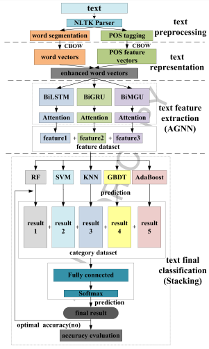

# PAGNN-Stacking
A hybrid model for text classification using part-of-speech features （PAGNN-Stacking） accepted by Journal of Intelligent & Fuzzy Systems (2023)

Datasets avaliable:
(i) This dataset was obtained from: http://ai.stanford.edu/amaas/data/sentiment/
(ii) This dataset was obtained from: https://nlp.stanford.edu/sentiment/
(iii) This dataset was obtained from: https://s3.amazonaws.com/fast-ai-nlp/ag news csv.tgz
